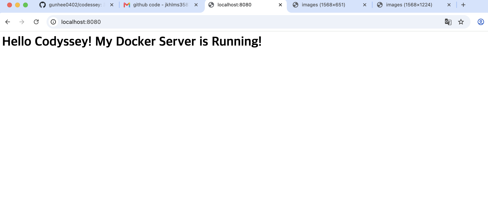

# 개발 워크스테이션 구축 및 Docker 실습 미션

## 1) 실행 환경 및 전제 조건
- **OS:** macOS (Apple Silicon)
- **Shell:** zsh
- **Container:** Docker (OrbStack) - 버전 28.5.2
- **Editor:** Visual Studio Code
- **Git:** git version 2.55.0
- **작업 경로 (절대 경로):** `/Users/jkhlms35873333587/codyssey-mission` (반드시 해당 위치에서 명령 실행)

---

## 2) 실행 방법
### 1. 이미지 빌드
```bash
docker build -t my-web-server .
```

### 2. 컨테이너 실행
docker run -d -p 8080:80 --name my-web my-web-server

### 3. 접속 주소
3. 접속 주소 및 확인
접속 URL: http://localhost:8080


CLI 접속 검증: curl http://localhost:8080


## 3) 수행 체크리스트
- [x] 터미널 기본 조작 및 폴더 구성
- [x] 권한 변경 실습
- [x] Docker 설치/점검
- [x] hello-world 실행
- [x] Dockerfile 빌드/실행
- [x] 포트 매핑 접속(2회)
- [x] 바인드 마운트 반영
- [x] 볼륨 영속성
- [x] Git 설정 + VSCode GitHub 연동

## 4) 수행 로그 및 증거 자료

#### 1. 터미널 기본 명령어 실습 및 Git 초기 설정
# 터미널 실습 및 작업 경로 확인
$ pwd
/Users/jkhlms35873333587

$ mkdir codyssey-mission
$cd codyssey-mission$ pwd
/Users/jkhlms35873333587/codyssey-mission

$ touch test.txt
$ ls -la
total 0
drwxr-xr-x   3 jkhlms35873333587  jkhlms35873333587   96 Jul 28 21:20 .
drwxr-x---+ 19 jkhlms35873333587  jkhlms35873333587  608 Jul 28 21:19 ..
-rw-r--r--   1 jkhlms35873333587  jkhlms35873333587    0 Jul 28 21:20 test.txt

# 권한 변경 실습 (+x 부여)
$ chmod +x test.txt
$ ls -al test.txt
-rwxr-xr-x  1 jkhlms35873333587  jkhlms35873333587  0 Jul 28 21:20 test.txt

# Git 설정 및 첫 커밋
$ git config --global user.name "jeong gunhee"
$ git config --global user.email "jkhlms3587333@gmail.com"
$git init$ git add test.txt
$ git commit -m "첫 번째 커밋: 터미널 실습 파일 추가"
$git branch -M main$ git remote add origin [https://github.com/gunhee0402/codessey.git](https://github.com/gunhee0402/codessey.git)
$ git push -u origin main -f
Enumerating objects: 3, done.
Counting objects: 100% (3/3), done.
Writing objects: 100% (3/3), 220 bytes | 220.00 KiB/s, done.
To [https://github.com/gunhee0402/codessey.git](https://github.com/gunhee0402/codessey.git)
 * [new branch]      main -> main

 #### 2. Docker 설치 점검 및 hello-world 실행
 Docker 엔진이 정상적으로 설치 및 동작하는지 버전 확인과 기본 컨테이너를 실행하여 점검했습니다.

 # Docker 버전 확인
$ docker --version
Docker version 28.5.2, build ecc6942

# hello-world 실행
$ docker run hello-world
Unable to find image 'hello-world:latest' locally
latest: Pulling from library/hello-world
4f55086f7dd0: Pull complete
Digest: sha256:c3cbe1cc1aa588a64951ac6286e0df7b27fe2e6324b1001c619bb358770c0178
Status: Downloaded newer image for hello-world:latest

Hello from Docker!
This message shows that your installation appears to be working correctly.

#### 3. Docker 환경 구축 및 웹 서버 실행
`Dockerfile`을 작성하여 Nginx 기반의 커스텀 이미지를 빌드했습니다.
컨테이너를 실행하여 브라우저(`http://localhost:8080`) 및 `curl` 명령으로 접속을 확인했습니다.

```bash
# 프로젝트 구조 생성
$ mkdir site
$ touch site/index.html
$ echo '<h1>Hello Codyssey!</h1>' > site/index.html
$ touch Dockerfile
```

**Dockerfile 내용:**
```dockerfile
FROM nginx:latest
COPY ./site/index.html /usr/share/nginx/html/index.html
EXPOSE 80
```

```bash
# Docker 이미지 빌드
$ docker build -t my-web-server .
[+] Building 1.9s (7/7) FINISHED                                        docker:orbstack
 => [internal] load build definition from Dockerfile                               0.1s
 => [2/2] COPY ./site/index.html /usr/share/nginx/html/index.html                 0.1s
 => naming to docker.io/library/my-web-server                                      0.0s

# 컨테이너 실행 (포트 8080 매핑)
$ docker run -d -p 8080:80 --name my-web my-web-server
4fd02f5085ecf42e8afca8cd3adf6845f5239d7dae2d9bc498c727cf131281eb

# 실행 상태 및 접속 확인
$ docker ps
CONTAINER ID   IMAGE           COMMAND                  CREATED          STATUS          PORTS                    NAMES
4fd02f5085ec   my-web-server   "/docker-entrypoint.…"   12 seconds ago   Up 12 seconds   0.0.0.0:8080->80/tcp     my-web

$ curl http://localhost:8080
<h1>Hello Codyssey!</h1>
```

#### 4. 볼륨 마운트 적용 및 실시간 반영
컨테이너를 삭제한 후, 로컬의 소스 코드와 컨테이너 내부를 연결하는 바인드 마운트를 적용했습니다.
이를 통해 컨테이너 삭제 후에도 데이터가 유지되며, 이미지 재빌드 없이 소스 수정 사항이 즉시 반영됨을 확인했습니다.

```bash
# 기존 컨테이너 중지 및 삭제
$ docker stop my-web
my-web
$ docker rm my-web
my-web

# 정리 상태 및 보관 이미지 목록 확인
$ docker ps -a
CONTAINER ID   IMAGE     COMMAND   CREATED   STATUS    PORTS     NAMES

$ docker images
REPOSITORY      TAG       IMAGE ID       CREATED         SIZE
my-web-server   latest    188bc60ebb58   2 minutes ago   187MB

# 볼륨 마운트 옵션(-v)을 사용하여 재실행
$docker run -d -p 8080:80 --name my-web -v$(pwd)/site:/usr/share/nginx/html my-web-server
8de4feae7ee9ccfc79538bd37d33e0f4db6db410d95f5efa822e37637686264c

# 소스 코드 변경 시 실시간 반영 확인
$ echo '<h1>Hello Codyssey! Updated via Bind Mount!</h1>' > site/index.html
$ curl http://localhost:8080
<h1>Hello Codyssey! Updated via Bind Mount!</h1>

# 최종 결과 확인 후 Git 푸시
$git add .$ git commit -m "Final: Docker web server setup with volume mount"
$ git push origin main
To [https://github.com/gunhee0402/codessey.git](https://github.com/gunhee0402/codessey.git)
   439c00d..ca9ef0f  main -> main
```

## 5) 주요 개념 정리 및 문제 해결 (Troubleshooting)
#### 1. 프로젝트 디렉토리 구조 및 설계 기준
codyssey-mission/: 프로젝트 루트 디렉터리

Dockerfile: Nginx 기반 웹 서버 커스텀 이미지 빌드 명세

site/index.html: 웹 서버가 제공할 정적 웹 페이지 소스

test.txt: 리눅스 권한 및 Git 초기 실습 파일

#### 2. Docker Image vs Container
Image (읽기 전용 / 불변): 애플리케이션 실행에 필요한 모든 파일과 설정을 담고 있는 스냅샷입니다.

Container (실행 인스턴스): 이미지를 기반으로 격리된 공간에서 실행되는 프로세스입니다.

#### 3. 포트 노출 및 네임스페이스 격리
Docker는 Linux Namespace를 활용하여 네트워크를 독립적으로 격리합니다. 따라서 호스트에서 컨테이너 내부 서비스로 접근하려면 -p 8080:80과 같이 호스트 포트와 컨테이너 포트를 연결(Port Forwarding)해야 합니다.

#### 4. 마운트 경로 선택 기준 (절대 경로 vs 상대 경로)
Docker 바인드 마운트(-v) 시 호스트 경로는 반드시 절대 경로여야 합니다. 이 때문에 환경에 구애받지 않고 현재 디렉터리의 절대 경로를 반환하는 $(pwd)를 사용합니다.

#### 5. 리눅스 권한 숫자 규칙
755 (rwxr-xr-x): 소유자(읽기/쓰기/실행), 그룹 및 기타(읽기/실행). 스크립트나 디렉터리에 적용.

644 (rw-r--r--): 소유자(읽기/쓰기), 그룹 및 기타(읽기). 일반 소스 코드 및 문서에 적용.

#### 6. 포트 충돌 진단 및 해결 순서
포트 점검: lsof -i :8080

프로세스 종료: kill -9 <PID>

포트 변경 실행: docker run -d -p 8081:80 ...

#### 7. 볼륨 백업 권장 절차
$docker run --rm --volumes-from my-web -v$(pwd):/backup ubuntu tar cvf /backup/backup.tar /usr/share/nginx/html

#### 8. 트러블슈팅 이력 (시도 가설 및 조치)
증상: zsh: event not found: </h1> 에러 발생

가설: Zsh 셸에서 큰따옴표 내의 느낌표(!)를 이전 실행 히스토리 검색 특수문자로 오인함.

조치: 작은따옴표(' ')로 감싸서 실행하여 정상 작성 완료 (echo '<h1>...</h1>' > site/index.html).